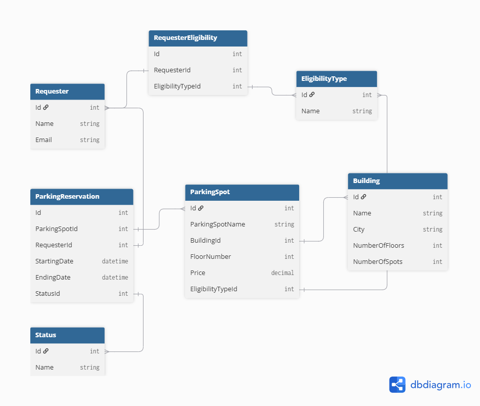

# Database for ParkUp

While creating the database, the main goal was to efficiently store the data about parking reservations made by requesters. The database contains seven tables:

- Requester
- EligibilityType
- RequesterEligibility
- Building
- ParkingSpot
- Status
- ParkingReservation

## Requester

Contains the data about the user who's initiating the request for reserving a parking spot. It contains an **Id**, **Name** and **Email** fields.

## EligibilityType

Contains data about the different types of eligibility used for a parking space. For example: a parking spot can be reserved for disabled people, large families, or oversized vehicles. Each row represents one such eligibility category. It contains an **Id** and a **Name** field.

## RequesterEligibility

A many-to-many mapping table connecting **Requester** and **EligibilityType**. Since a single requester can hold multiple eligibilities (e.g. both "Disabled" and "LargeFamily"), and a single eligibility type can apply to multiple requesters, this junction table stores each requester-eligibility pair as a separate row. It contains an **Id**, a **RequesterId** (foreign key to Requester), and an **EligibilityTypeId** (foreign key to EligibilityType).

## Building

Contains data about the physical buildings where parking spots are located. It contains an **Id**, **Name**, **City**, **NumberOfFloors**, and **NumberOfSpots** field. Each building can have multiple parking spots associated with it.

## ParkingSpot

Contains data about the individual parking spots available for reservation. Each spot belongs to exactly one building and is located on a specific floor. A parking spot may optionally be restricted to requesters with a specific eligibility — for example, a spot reserved for disabled visitors. It contains an **Id**, **ParkingSpotName**, **BuildingId** (foreign key to Building), **FloorNumber**, **Price**, and an optional **EligibilityTypeId** (foreign key to EligibilityType; null if the spot has no restriction).

## Status

Contains the possible states a parking reservation can be in, such as *Pending*, *Accepted*, *Rejected*, or *Cancelled*. Using a dedicated table instead of a hardcoded enum makes it easy to add or rename statuses without changing the schema. It contains an **Id** and a **Name** field.

## ParkingReservation

Contains data about the reservation requests made by requesters for specific parking spots. Each reservation links a requester to a parking spot for a given time period, and tracks the current state of the request through its status. It contains an **Id**, **ParkingSpotId** (foreign key to ParkingSpot), **RequesterId** (foreign key to Requester), **StartingDate**, **EndingDate**, and **StatusId** (foreign key to Status).
